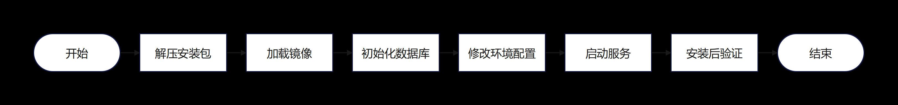
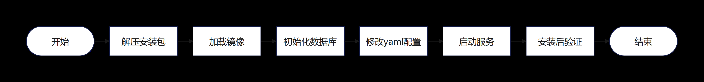

# 安装部署指南
### 一、前置条件
#### 1、已获取到部署安装包 AgentBuilder.tar.gz
* 部署安装包打包方法参考[源码编译构建指导.md](../docker/%E6%BA%90%E7%A0%81%E7%BC%96%E8%AF%91%E6%9E%84%E5%BB%BA%E6%8C%87%E5%AF%BC.md)

### 二、第三方组件依赖
* mysql
* redis
* obs

### 三、基于DockerCompose安装
#### 1、环境要求
* Docker 19.03 or later
* Docker Compose 1.28 or later

#### 2、安装流程

#### 3、安装步骤
##### 步骤 1、解压安装包：
tar -zxvf AgentBuilder.tar.gz

##### 步骤 2、加载镜像（需要替换为实际镜像压缩包名）
`cd image`

`docker load -i studio-manager_*.tar`

`docker load -i studio-service_*.tar`

`docker load -i studio-runtime_*.tar`

`docker load -i studio-console_*.tar`

##### 步骤 3、初始化数据库
在数据库执行init.sql

##### 步骤 4、修改环境配置
`cd compose`

`vi .env.example`

`cp .env.example .env`

##### 步骤 5、启动服务
`cd compose`
###### Docker Compose V1
docker-compose up -d

###### Docker Compose V2
docker compose up -d

##### 步骤 6、安装后验证
在浏览器中输入以下地址并访问：

http://节点ip/openjiuwen/#/home/overview

### 四、基于K8s安装
#### 1、环境要求
* 推荐使用Kubernetes v1.32版本

#### 2、安装流程

#### 3、安装步骤
##### 步骤 1、解压安装包：
tar -zxvf AgentBuilder.tar.gz

##### 步骤 2、加载镜像（需要替换为实际镜像压缩包名，每个节点都需要加载）
`cd image`

`docker load -i studio-manager_*.tar`

`docker load -i studio-service_*.tar`

`docker load -i studio-runtime_*.tar`

`docker load -i studio-console_*.tar`

##### 步骤 3、初始化数据库
在数据库执行init.sql

##### 步骤 4、修改yaml配置
`cd k8s`
###### 修改 studio-manager.yaml
`vim studio-manager.yaml`
* 修改镜像信息：将spec.template.spec.containers.image的值改为studio-manager 的镜像信息（格式IMAGE:TAG）
* 修改服务环境变量：spec.template.spec.containers.env（根据注释提示进行配置）

###### 修改 studio-service.yaml
`vim studio-service.yaml`
* 修改镜像信息：将spec.template.spec.containers.image的值改为studio-service 的镜像信息（格式IMAGE:TAG）
* 修改服务环境变量：spec.template.spec.containers.env（根据注释提示进行配置）

###### 修改 studio-runtime.yaml
`vim studio-runtime.yaml`
* 修改镜像信息：将spec.template.spec.containers.image的值改为studio-runtime 的镜像信息（格式IMAGE:TAG）
* 修改服务环境变量：spec.template.spec.containers.env（根据注释提示进行配置）

###### 修改 studio-console.yaml
`vim studio-console.yaml`
* 修改镜像信息：将spec.template.spec.containers.image的值改为studio-console 的镜像信息（格式IMAGE:TAG）

##### 步骤 5、启动服务
`cd k8s`
###### 启动studio-manager
`kubectl apply -f studio-manager.yaml`

###### 启动studio-service
`kubectl apply -f studio-service.yaml`

###### 启动studio-runtime
`kubectl apply -f studio-runtime.yaml`

###### 启动studio-console
`kubectl apply -f studio-console.yaml`

##### 步骤 6、安装后验证
###### 在浏览器中输入以下地址并访问：
http://节点ip:30001/openjiuwen/#/home/overview